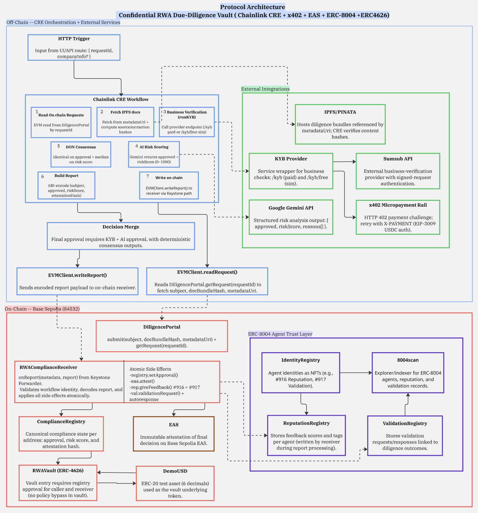

# DeepSeal

<p align="center">
  <strong>Confidential RWA Due-Diligence Vault</strong><br/>
  Chainlink CRE · x402 · EAS · ERC-8004 · ERC-4626
</p>

<p align="center">
  <a href="https://github.com/arunabha003/DeepSeal"></a>
  
  
  
  
</p>

<p align="center">
  <a href="#overview">Overview</a> ·
  <a href="#protocol-architecture">Architecture</a> ·
  <a href="#live-deployment-base-sepolia">Live Addresses</a> ·
  <a href="#quick-start-using-deployed-contracts">Quick Start</a> ·
  <a href="#chainlink-cre-files">CRE Files</a>
</p>

---

## Overview

DeepSeal is a compliance-gated ERC-4626 vault system for Real World Assets, where access is controlled by an automated due-diligence pipeline that orchestrates KYB verification (Sumsub via x402 micropayments), confidential PII redaction, AI risk scoring (Google Gemini), on-chain attestations (EAS), and agent reputation tracking (ERC-8004) — all powered by a single Chainlink CRE workflow.

One CRE workflow execution reads an on-chain request, resolves an IPFS document bundle, verifies the company via KYB, redacts sensitive fields, scores risk with Gemini AI, and writes the result on-chain — triggering a multi-contract transaction that updates compliance state, records an EAS attestation, writes ERC-8004 reputation artifacts, syncs the per-asset registry, and links or creates an asset-specific vault.

---

## Protocol Architecture




---

## Documentation Index

- Full implementation: [`docs/implementation.md`](docs/implementation.md)
- Base Sepolia deployment guide: [`docs/base-sepolia-deployment.md`](docs/base-sepolia-deployment.md)
- Anvil + Base Sepolia fork E2E guide: [`docs/anvil-base-sepolia-e2e.md`](docs/anvil-base-sepolia-e2e.md)
- Pitch deck slides: [`docs/deck/`](docs/deck/)
- Protocol architecture diagram: [`docs/protocol-diagram.png`](docs/protocol-diagram.png)
- Sample company bundle payload: [`docs/acme-company-bundle.upload.json`](docs/acme-company-bundle.upload.json)

---

## Core Components

| Layer | Component | What it does |
|---|---|---|
| Orchestration | **Chainlink CRE** | Runs the end-to-end due-diligence workflow and writes the final report on-chain via `EVMClient.writeReport()`. |
| Payment Rail | **x402** | Handles KYB endpoint micropayments (402 challenge → signed USDC transfer auth → retry). |
| Privacy Controls | **Confidential HTTP** | Runs sensitive calls (doc resolve, KYB, PII redaction, audit sink) offchain with protected secrets/inputs. |
| Verification | **Sumsub (KYB)** | Returns business verification outcome and provider risk signal. |
| Risk Engine | **Google Gemini** | Produces structured `{ approved, riskScore, reasons[] }` output from PII-redacted company context over standard HTTPS. |
| Audit Trail (Offchain) | **Confidential Audit Sink** | Receives private completion payloads (`requestId`, hashes, decision, x402 tx hash) for compliance logging. |
| Attestation | **EAS** | Stores immutable on-chain compliance proof for each finalized decision. |
| Agent Trust | **ERC-8004** | Tracks agent identity + reputation + validation artifacts for the receiver-linked DeepSeal agents. |
| Storage | **IPFS / Pinata** | Stores diligence bundles referenced by `metadataUri`; CRE verifies deterministic hashes. |
| Vault | **RWAAssetRegistry + RWAVaultFactory + ERC-4626** | Tracks request-scoped assets and auto-creates per-asset compliance-gated vaults. |
| UI | **Next.js Frontend** | Real-time SSE pipeline monitoring + request, process, vault, compliance, and agent views. |

---

## Live Deployment (Base Sepolia)

| Contract | Address |
|---|---|
| DemoUSD | [`0x0a613896f3A69d7DA53e9c2503F01283966223C1`](https://sepolia.basescan.org/address/0x0a613896f3A69d7DA53e9c2503F01283966223C1) |
| ComplianceRegistry | [`0xa47749699925e9187906f5A0361D5073397279b3`](https://sepolia.basescan.org/address/0xa47749699925e9187906f5A0361D5073397279b3) |
| DiligencePortal | [`0xe6257bd26941cB6C3B977Fe2b2859aE7180396a4`](https://sepolia.basescan.org/address/0xe6257bd26941cB6C3B977Fe2b2859aE7180396a4) |
| RWAComplianceReceiver | [`0x48935538CEbdb57b7B75D2476DC6C9b3A1cceDD6`](https://sepolia.basescan.org/address/0x48935538CEbdb57b7B75D2476DC6C9b3A1cceDD6) |
| RWAVault | [`0x15FfbD328C9A0280027E04503A3F15b6bdea91e5`](https://sepolia.basescan.org/address/0x15FfbD328C9A0280027E04503A3F15b6bdea91e5) |
| RWAAssetRegistry | [`0xBd622016b404f668e63a31BB2b5ADe4aCf4ee2df`](https://sepolia.basescan.org/address/0xBd622016b404f668e63a31BB2b5ADe4aCf4ee2df) |
| RWAVaultFactory | [`0x9827E6289EC4309cdb3A7326bF4F1816e8B09B28`](https://sepolia.basescan.org/address/0x9827E6289EC4309cdb3A7326bF4F1816e8B09B28) |
| ValidationRegistry | [`0x7Ee89Ce38ece271262409210f2223205E3D76949`](https://sepolia.basescan.org/address/0x7Ee89Ce38ece271262409210f2223205E3D76949) |
| IdentityRegistry *(official ERC-8004)* | [`0x8004A818BFB912233c491871b3d84c89A494BD9e`](https://sepolia.basescan.org/address/0x8004A818BFB912233c491871b3d84c89A494BD9e) |
| ReputationRegistry *(official ERC-8004)* | [`0x8004B663056A597Dffe9eCcC1965A193B7388713`](https://sepolia.basescan.org/address/0x8004B663056A597Dffe9eCcC1965A193B7388713) |
| EAS Contract *(Base native)* | [`0x4200000000000000000000000000000000000021`](https://sepolia.basescan.org/address/0x4200000000000000000000000000000000000021) |
| EAS Schema Registry | [`0x4200000000000000000000000000000000000020`](https://sepolia.basescan.org/address/0x4200000000000000000000000000000000000020) |

- ERC-8004 agents: [#1154 Reputation](https://testnet.8004scan.io/agents/base-sepolia/1154), [#1155 Validation](https://testnet.8004scan.io/agents/base-sepolia/1155), [Browse all](https://testnet.8004scan.io/agents/base-sepolia)
- EAS schema UID: `0x91f39675fa85b9340ba36983e388a4b9238c55ac7f593f2c87ba0c55115dd06a`

---

## Chainlink CRE Files

| File | Description |
|---|---|
| [`cre/chainlink-Convergence/my-workflow/main.ts`](cre/chainlink-Convergence/my-workflow/main.ts) | Main CRE workflow (trigger → on-chain read → bundle resolve/verify → KYB/x402 → PII redaction → Gemini → confidential audit → on-chain report). |
| [`cre/chainlink-Convergence/my-workflow/config.anvil-e2e.json`](cre/chainlink-Convergence/my-workflow/config.anvil-e2e.json) | Local Anvil fork config. |
| [`cre/chainlink-Convergence/my-workflow/config.staging.json`](cre/chainlink-Convergence/my-workflow/config.staging.json) | Base Sepolia staging config. |
| [`cre/chainlink-Convergence/project.yaml`](cre/chainlink-Convergence/project.yaml) | CRE project targets and RPC profiles. |
| [`cre/chainlink-Convergence/secrets.yaml`](cre/chainlink-Convergence/secrets.yaml) | CRE secret map template. |
| [`cre/README.md`](cre/README.md) | CRE-specific runbook and commands. |
| [`src/RWAComplianceReceiver.sol`](src/RWAComplianceReceiver.sol) | On-chain receiver for CRE reports; applies compliance/EAS/ERC-8004 and per-asset vault effects. |
| [`src/RWAAssetRegistry.sol`](src/RWAAssetRegistry.sol) | Request-scoped asset records keyed by `assetId`, including compliance decision snapshots. |
| [`src/RWAVaultFactory.sol`](src/RWAVaultFactory.sol) | Creates and resolves per-asset ERC-4626 vaults used by the Vault page. |
| [`services/kyb-provider/src/server.mjs`](services/kyb-provider/src/server.mjs) | Provider service (Sumsub + x402 + `/docs/resolve` + `/pii/redact` + `/audit/webhook`). |
| [`app/src/app/api/workflow/run/route.ts`](app/src/app/api/workflow/run/route.ts) | SSE endpoint that runs CRE simulation, then broadcasts `onReport` on-chain and streams pipeline status. |

---

## How CRE is used in DeepSeal

CRE is the deterministic execution layer between off-chain evidence and on-chain policy:

1. Trigger starts with `requestId`.
2. Workflow reads request from `DiligencePortal`.
3. Workflow resolves + verifies document bundle.
4. Workflow executes KYB call (paid x402 path when enabled).
5. Workflow redacts PII via Confidential HTTP before LLM inference.
6. Workflow computes AI risk output (Gemini structured JSON) over regular HTTPS on redacted payload.
7. Workflow merges outputs under policy constraints.
8. Workflow writes canonical report to `RWAComplianceReceiver`.
9. Workflow sends confidential audit payload to private sink.
10. Receiver applies atomic on-chain side effects.

---

## Quick Start (Using Deployed Contracts)

### Prerequisites

- Node.js `>=18`
- Chainlink CRE CLI (`cre`) in PATH
- Foundry (optional, for CLI request submission)
- Gemini API key
- Sumsub sandbox keys (or `FORCE_APPROVE=true` for demos)

### 1) Clone + Install

```bash
git clone https://github.com/arunabha003/Chainlink-Convergence.git
cd Chainlink-Convergence

cd app && npm install && cd ..
cd services/kyb-provider && npm install && cd ../..
```

### 2) Configure env files

```bash
cp .env.example .env
cp services/kyb-provider/.env.example services/kyb-provider/.env
cp cre/chainlink-Convergence/.env.example cre/chainlink-Convergence/.env
cp cre/chainlink-Convergence/my-workflow/config.staging.example.json cre/chainlink-Convergence/my-workflow/config.staging.json
cp app/.env.local.example app/.env.local
```

Fill secrets in those copied files (`.env`, `services/kyb-provider/.env`, `cre/.../.env`, `app/.env.local`).

For IPFS reliability, set `DOC_RESOLVER_IPFS_GATEWAY` in `services/kyb-provider/.env` to your pinning gateway (for example, your Pinata gateway) instead of default public gateways.
For demo-only approval flow, set `demoForceApproveOnKyb=true` in your workflow config (`config.anvil-e2e.json` / `config.staging.json`).

### 3) Optional Sumsub sanity checks

```bash
curl -s http://127.0.0.1:3001/sumsub/healthz | jq

cd services/kyb-provider
npm run check:sumsub
```

### 4) Start local services

```bash
# terminal 1
cd services/kyb-provider && npm start

# terminal 2
cd app && npm run dev
```

### 5) Run full flow from UI

1. Open `http://localhost:3000/submit` and create request.
2. Open `http://localhost:3000/process` and run CRE workflow.
3. Watch live SSE steps for KYB, AI scoring, and on-chain write.
   - This mode broadcasts a real `RWAComplianceReceiver.onReport()` transaction and shows the tx hash.
4. Validate output in `http://localhost:3000/compliance`.
5. Test vault behavior in `http://localhost:3000/vault`.
6. Inspect agents in `http://localhost:3000/agents`.

### 6) Run CRE simulation directly (CLI)

```bash
cd cre/chainlink-Convergence
PAYLOAD='{"requestId":1}'
cre workflow simulate ./my-workflow \
  --target staging-settings \
  --trigger-index 0 \
  --http-payload "$PAYLOAD" \
  --non-interactive \
  -e .env
```

For full deployment and anvil fork flow:
- [`docs/base-sepolia-deployment.md`](docs/base-sepolia-deployment.md)
- [`docs/anvil-base-sepolia-e2e.md`](docs/anvil-base-sepolia-e2e.md)

---


## License

MIT
